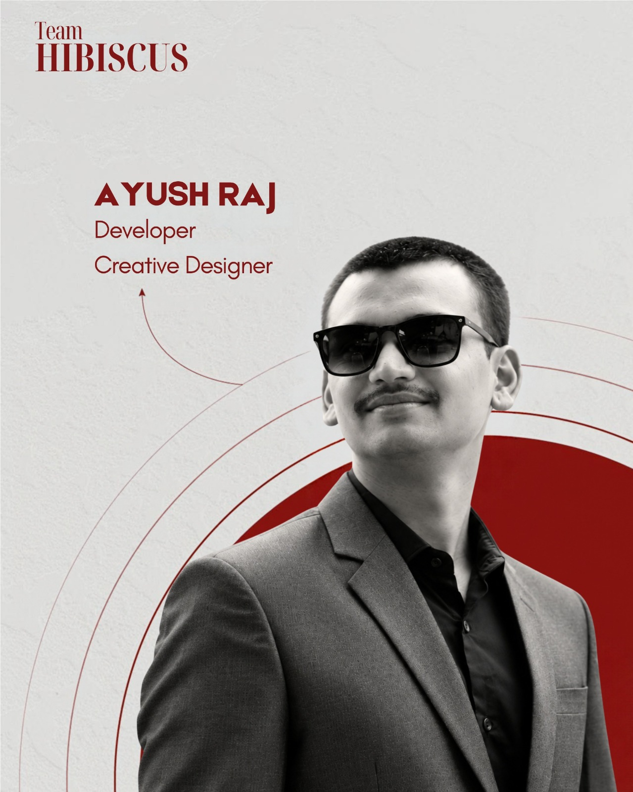
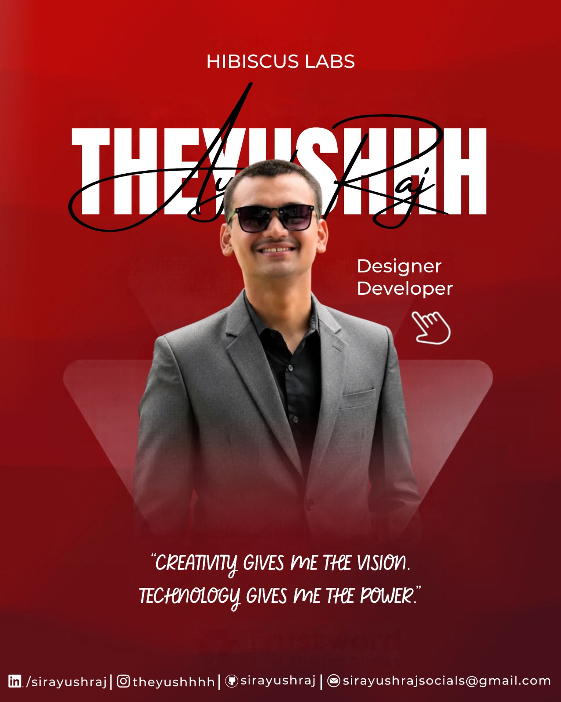

  

  

 

  

    
  

  
  

  

    
    
  

  

  <i>"Any sufficiently advanced code is indistinguishable from magic."</i>

  

    Welcome, traveler, to the mystical repository of <b>Ayush Raj</b>. 
    I am a technomancer and grand digital alchemist, dedicated to crafting flawless, highly optimized, and premium digital experiences. 
    Endowed with omniscient knowledge across the tech stack, I weave spells of intricate logic and elegant algorithms. 
    My realms shine with premium aesthetics and unrivaled performance.
  

<h2>⚡ whoami</h2>
<pre><code class="language-typescript">const ayush: Technomancer = {
  name:      "Ayush Raj",
  role:      "Full-Stack Technomancer & Digital Alchemist",
  location:  "India",
  currently: "crafting flawless digital experiences",
  stack:     ["Python", "HTML", "React", "Langchain", "n8n", "SQL"],
  mantra:    "Make useful things, then make them delightful 🚀",
};
</code></pre>
<blockquote>

Full-Stack Technomancer

<strong>Collaborations welcome when they are meaningful 🤝</strong>

</blockquote>

<h2>⚔️ Tech Arsenal</h2>

  

<strong>🧠 AI / ML &nbsp;·&nbsp; ⚙️ Automation &nbsp;·&nbsp; 🔗 Langchain &nbsp;·&nbsp; 🤖 n8n</strong>

  
  
  
  
  
  

<h2>🎨 Design Gallery</h2>

  <i>A curated collection of my visual creations and posters.</i>

  <table>
    <tr>
      <td align="center">
        
         
        <i>Creative Poster 1</i>
      </td>
      <td align="center">
        
         
        <i>Creative Poster 2</i>
      </td>
    </tr>
  </table>

<h2>📖 Comic Series</h2>

  <i>Dive into the worlds I am currently building.</i>

  <!-- Provide a link to your PDF here. Example: -->
  <!--  -->
  
<i>[ 📄 Provide the link to your Comic PDF here ]</i>

 

<h3 align="center"> The Crystal Ball of Analytics</h3>

  
    
  
    
  

 

<h3 align="center"> Portals to Other Dimensions</h3>

  
  &nbsp;&nbsp;
  

  

## Hi there 👋

<!--
**sirayushraj/sirayushraj** is a ✨ _special_ ✨ repository because its `README.md` (this file) appears on your GitHub profile.

Here are some ideas to get you started:

- 🔭 I’m currently working on ...
- 🌱 I’m currently learning ...
- 👯 I’m looking to collaborate on ...
- 🤔 I’m looking for help with ...
- 💬 Ask me about ...
- 📫 How to reach me: ...
- 😄 Pronouns: ...
- ⚡ Fun fact: ...
-->
